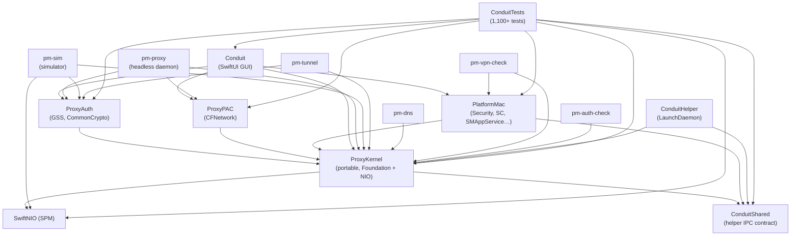
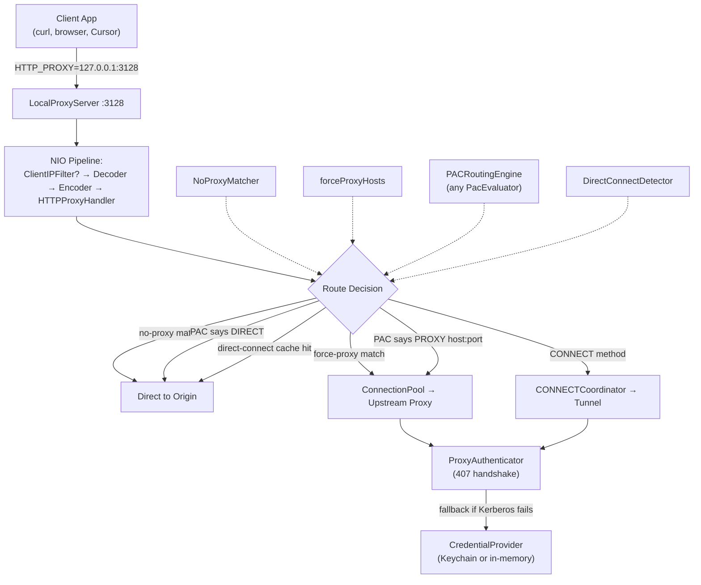

# Conduit Architecture

> Describes the multi-target shape that landed in the module split, plus the subsequent security additions (the CFNetwork PAC evaluator and `SecretBytes`) and the orchestrator/UI performance cleanup. For the file-by-file migration history and the rationale behind every seam, read [`docs/design-module-split.md`](./design-module-split.md). For the higher-level product roadmap that commissioned the split, read [`roadmap-v2.md`](roadmap-v2.md) and [`ROADMAP.md`](../ROADMAP.md).

## Overview

Conduit is a macOS application that runs a local HTTP/SOCKS5 proxy server with corporate proxy authentication (Kerberos/NTLM), PAC-aware routing, DNS-over-HTTPS forwarding, protocol tunnels, and system integration. It bridges the gap between corporate proxy infrastructure and macOS applications that don't natively support authenticated proxies.

The codebase is a SwiftPM package with five library targets and eight executable targets, totaling ~21,000 lines of Swift across ~100 source files plus ~12,000 lines of tests. Post-split, every cross-target call goes through a `package protocol` in `Sources/ProxyKernel/Abstractions/` — the macOS-specific code cannot be reached from headless or portable targets without an explicit conformer.

```
Conduit/
├── Sources/
│   ├── ProxyKernel/          50 files, 10.6k LOC  — portable library (Foundation + NIO)
│   ├── ProxyAuth/             3 files,    0.8k LOC  — NTLM/Kerberos (GSS + CommonCrypto)
│   ├── ProxyPAC/              1 file,     0.4k LOC  — PAC evaluator (CFNetwork)
│   ├── PlatformMac/          15 files,   2.1k LOC  — macOS glue (Security, SC, SMAppService…)
│   ├── ConduitShared/    1 file,     0.2k LOC  — helper wire contract (no deps)
│   ├── Conduit/         14 files,   3.8k LOC  — SwiftUI GUI + wiring layer
│   ├── ConduitHelper/    4 files,    0.4k LOC  — privileged LaunchDaemon
│   ├── pm-proxy/              1 file,     0.3k LOC  — headless HTTP/SOCKS5/DNS/tunnel CLI
│   ├── pm-dns/                1 file,     0.1k LOC  — standalone DoH forwarder
│   ├── pm-tunnel/             1 file,     0.2k LOC  — standalone TCP tunnel forwarder
│   ├── pm-sim/                9 files,   2.0k LOC  — fault-injection simulator
│   ├── pm-vpn-check/          1 file,     0.1k LOC  — VPN status diagnostic
│   └── pm-auth-check/         1 file,     0.5k LOC  — auth diagnostic
└── Tests/
    └── ConduitTests/    83 files,  ~13k LOC  — 1,100+ tests, 5 skipped
```

SwiftNIO is a remote SwiftPM dependency (`https://github.com/apple/swift-nio.git`), resolved at build time — there is no vendored copy in-tree.

LOC and file counts approximate; the source-of-truth is `swift test` and `find Sources -name '*.swift' | wc -l`. The suite has grown past 1,100 tests across the CFNetwork PAC evaluator and `SecretBytes` work, the security-hardening wave, the perf cleanup, and the security-foundation batch.

## Target Dependency Graph

The load-bearing invariant: `pm-proxy` does **not** depend on `PlatformMac`. The build is the test that the kernel stayed portable — if a kernel file sneaks in an `import Security` or an `import SystemConfiguration`, `pm-proxy` fails to link.



| Target               | ProxyKernel | ProxyAuth | ProxyPAC | PlatformMac | Shared | NIO* |
| -------------------- | :---------: | :-------: | :------: | :---------: | :----: | :--: |
| `ProxyKernel`        | —           | —         | —        | —           | ✓      | ✓    |
| `ProxyAuth`          | ✓           | —         | —        | —           | —      | —    |
| `ProxyPAC`           | ✓           | —         | —        | —           | —      | —    |
| `PlatformMac`        | ✓           | —         | —        | —           | ✓      | —    |
| `pm-proxy`           | ✓           | ✓         | ✓        | —           | —      | —    |
| `pm-sim`             | ✓           | ✓         | —        | —           | —      | ✓    |
| `pm-tunnel`          | ✓           | ✓         | —        | —           | —      | —    |
| `pm-dns`             | ✓           | —         | —        | —           | —      | —    |
| `pm-vpn-check`       | ✓           | —         | —        | ✓           | —      | ✓    |
| `pm-auth-check`      | ✓           | —         | —        | —           | —      | —    |
| `ConduitHelper` | ✓           | —         | —        | —           | ✓      | —    |
| `Conduit` (app) | ✓           | ✓         | ✓        | ✓           | —      | —    |
| `ConduitTests`  | ✓           | ✓         | ✓        | ✓           | ✓      | ✓    |

The matrix shows **direct** dependencies declared in `Package.swift`. Transitive reach differs: `Conduit` (app) reaches `ConduitShared` through `PlatformMac → Shared` and so can use the helper wire types without declaring a direct dep; `pm-proxy` and the other headless tools have no such transitive path, which is the invariant the fence is built to guarantee.

### What each target owns

- **`ConduitShared`** — zero-dependency wire contract between the app and the privileged helper. Defines `HelperCommand`, `HelperRequest`, `HelperResponse`, input validation. Imported by both sides so they can't drift.
- **`ProxyKernel`** — portable library: proxy server, connection pool, PAC routing engine, DNS forwarder, transparent TCP proxy, tunnel forwarder, auto-recovery ladder, health checks, VPN state fusion, upstream probing, routing decisions, metadata blocklist, kernel-side abstractions. Imports Foundation, Dispatch, Darwin (libc), and SwiftNIO only. CI grep enforces no `import Security / SMAppService / UserNotifications / SystemConfiguration / Network / ServiceManagement / JavaScriptCore / GSS / CommonCrypto / Combine / AppKit / SwiftUI`.
- **`ProxyAuth`** — opt-in capability layer. NTLM message generation (`NTLMAuth.swift`, CommonCrypto for MD4/HMAC-MD5), Kerberos/Negotiate (`KerberosAuth.swift`, GSS.framework), and `AuthenticatorFactory.swift` which assembles a `ProxyAuthenticator` from the active config + a `CredentialProvider`.
- **`ProxyPAC`** — opt-in capability layer with the CFNetwork-backed `CFPACEvaluator` (`CFNetworkExecuteProxyAutoConfigurationScript` on a private CFRunLoop, paired with `CFPacScriptEvaluator`). This is the sole production `PacEvaluator` implementation after the CFNetwork evaluator graduated; the JavaScriptCore-backed resolver was removed.
- **`PlatformMac`** — macOS-only glue. Keychain, `networksetup` wrappers, `SMAppService`, `SCDynamicStore`-based VPN monitor, `NWPathMonitor`, `/etc/resolver/*` writer, helper XPC client, shell runner, first-run example-corp preset injection. Only the GUI app and the `pm-vpn-check` diagnostic link this target.
- **`Conduit`** (app target) — SwiftUI GUI + `AppState`, the wiring layer that owns every `PlatformMac` concrete and passes protocol-typed references into the orchestrator. Also hosts `AppLogStore` (the `@MainActor` ring-buffered log store) because it imports `Combine` and can't live in the kernel.
- **`ConduitHelper`** — privileged LaunchDaemon at `/Library/PrivilegedHelperTools/io.github.srps.Conduit.Helper`. Communicates with the app over a Unix-domain socket at `/var/run/io.github.srps.Conduit.Helper.sock` using the `ConduitShared` contract. Depends on the kernel for `UDPRelay` / `TCPRelay` implementations.
- **Executables: `pm-proxy`, `pm-dns`, `pm-tunnel`, `pm-sim`, `pm-vpn-check`, `pm-auth-check`** — each is a narrow tool. `pm-proxy` is the flagship: it runs the full HTTP/SOCKS5/DNS/tunnel stack off `ProxyKernel + ProxyAuth + ProxyPAC` with no system-side effects (no Keychain, no `networksetup`, no `/etc/resolver`). `pm-sim` is the fault-injection harness used by CI.

## Kernel Internals

### Directory layout

```
Sources/ProxyKernel/
├── Abstractions/    Cross-target protocols (the seam directory)
├── Models/          Config, status, upstream, log types, defaults
├── Proxy/           NIO handlers, orchestrator, CONNECT, SOCKS5, PAC routing, tunnels
├── Network/         AutoRecovery, DNS forwarder, relays, VPN fusion, probers
├── Security/        ProxyCredentials value type + in-memory provider
└── Support/         RuntimeEnvironment, error formatting, stock log sinks, TCP keepalive
```

### Abstractions directory (the seam)

`Sources/ProxyKernel/Abstractions/` contains every cross-target protocol. Wide protocols invite god-objects; each file below is deliberately narrow.

| Protocol                 | Methods                               | Kernel callers                                       | Conformers                                                                                              | Introduced               |
| ------------------------ | ------------------------------------- | ---------------------------------------------------- | ------------------------------------------------------------------------------------------------------- | ------------------------ |
| `LogSink`                | 1 (+ `minLevel` prop + `@autoclosure` ext) | 15 files (~21 init params)                          | `ConsoleLogSink`, `DiscardingLogSink`, `RecordingLogSink` (kernel), `AppLogStore` (app)                 | module split             |
| `CredentialProvider`     | 2 (`credentials(for:)`, `setCredentials(_:for:)`) | 1 (`AuthenticatorFactory`)                 | `CredentialManager` (PlatformMac, Keychain), `InMemoryCredentialProvider` (kernel, headless/test)       | module split (later widened) |
| `PacEvaluator`           | 3 (`fetchPAC`, `makeEvaluator`, `routeChain`) | 1 (`PACRoutingEngine`)                         | `CFPACEvaluator` (CFNetwork-backed, ProxyPAC)                                                           | module split (CFNetwork rework) |
| `PacScriptEvaluating`    | 1 (`resolveProxyChain(for:)`)          | 1 (`PACRoutingEngine.jsEvaluator`)                   | `CFPacScriptEvaluator` (ProxyPAC)                                                                       | module split (CFNetwork rework) |
| `PrivilegeClient`        | 2 (`execute`, `status`)               | 2 (orchestrator relay calls, AppState helper status) | `HelperPrivilegeClient` (PlatformMac), `AppleScriptPrivilegeClient` (PlatformMac), `RecordingPrivilegeClient` (tests) | pre-split (surfaced during split) |
| `ProxyAuthenticator`     | Stateful per-handshake                | 4 NIO handlers                                       | `NTLMAuthenticator`, `KerberosAuthenticator`, `NegotiateAuthenticator` (ProxyAuth), `MockAuthenticator` (pm-sim) | pre-split                |
| `VPNStatusObserving`     | 2 (`setOnChange`, `start`)            | 1 (`AppState`)                                       | `VPNStatusMonitor` (PlatformMac), `FakeVPNStatusObserver` (pm-sim/tests)                                | pre-split                |
| `TunnelResolverApplying` | 3 (`cleanupStale`, `applyAll`, `removeAll`) | 1 (`TunnelForwarder`)                          | `TunnelResolverManager` (PlatformMac); test no-op on demand                                             | module split             |

Notes:

- **No protocol exceeds 3 required methods.** The `PlatformIntegration` composite (originally planned as an 8-method god protocol) is deliberately deferred to the daemon-first work — see [`docs/design-module-split.md § PlatformIntegration (deferred)`](./design-module-split.md).
- **`package` access** everywhere. Types are visible within the SwiftPM package but not to external consumers. SE-0386 is the reason the "cross-target call must go through a protocol" rule is enforced by the type system rather than by review.
- **`LogSink`'s `@autoclosure` extension** lets call sites skip message interpolation when a level is filtered out. `DiscardingLogSink.minLevel` returns `.error` (the highest case) so every `.debug`/`.info`/`.notice`/`.warning` call short-circuits before building the string.

### Models

`Sources/ProxyKernel/Models/` is pure Foundation — `Codable` value types that describe configuration, status, and log content.

| File                         | Contents                                                                                                                |
| ---------------------------- | ----------------------------------------------------------------------------------------------------------------------- |
| `ProxyConfig.swift`          | The ~50-field `Codable` root config + `testFixture()` (vendor-neutral)                                   |
| `ConfigDefaults.swift`       | `ConfigDefaultsProvider` protocol + `GenericDefaults` + `LegacyConfigMigration` (additive `decodeIfPresent` paths)     |
| `PresetLoader.swift`         | Bundled preset index/record loader for `Resources/Presets/*.json`; validates decoded configs before returning them      |
| `ConfigSections.swift`       | Nested `Codable` struct groupings referenced from `ProxyConfig`                                                        |
| `ConfigValidation.swift`     | Field-level validators — errors surface in `SettingsView` inline and block `ProxyConfigPersistence.save`                |
| `ConfigDiff.swift`           | Subsystem-level delta between two `ProxyConfig`s; the planned targeted reload will reuse this                          |
| `ProxyStatus.swift`          | `ProxyRuntimeStatus`, `ProxyMetrics`, `DirectModeCause` — the runtime snapshot fields                                  |
| `UpstreamProxy.swift`        | `Hashable` value type — the key for `CredentialProvider` conformers                                                    |
| `RuntimeEvent.swift`         | Structured event kinds + `RuntimeEventLog` (NIO-safe ring buffer). See STYLE rule 3.                              |
| `LogTypes.swift`             | `LogEntry`, `LogLevel`, `LogCategory` — consumed by every `LogSink` conformer                                          |
| `TunnelResolverPort.swift`   | `TunnelResolverPort.port = 15053` — the one constant shared between kernel (`TunnelForwarder`) and PlatformMac (`TunnelResolverManager`) |

### Proxy

NIO handlers, the orchestrator, routing, and tunneling.

- **`ProxyOrchestrator.swift`** (1.7k LOC, the largest file) — composes `LocalProxyServer`, `LocalDNSForwarder`, `TunnelForwarder`, `TransparentTCPProxy`, `TunnelDNSResponder`, `ConnectionPool`, `HealthChecker`, `AutoRecovery`, and `UpstreamProber` into one runtime. Takes `LogSink`, `CredentialProvider`, `PacEvaluator`, `PrivilegeClient`, `authenticatorProvider` — all protocol-typed; no `PlatformMac` concretes referenced. Exposes `configSnapshotProvider: @Sendable () -> ProxyConfig` — the one authoritative mirror of the live config, readable from any thread. **Two-tier snapshot emission** (added during the UI performance cleanup): state-transition callsites use `emitSnapshotImmediate()` (synchronous fire); per-request / per-connection / per-DNS-tick callsites use `emitSnapshotCoalesced()` (100 ms `DispatchSourceTimer` throttle). Counter-tier bursts collapse from N MainActor fan-outs/s to ≤10/s without changing what the UI shows (the `RuntimePresentationAdapter` re-coalesces published values at 1 Hz on top). State-transition emissions cancel pending coalesced flushes so there's no double-emit. See "Cross-target wiring" below.
- **`LocalProxyServer.swift`** — binds the HTTP proxy listener (default `127.0.0.1:3128`, configurable; gateway mode binds `0.0.0.0`). NIO pipeline: `ClientIPFilter?` → `HTTPRequestDecoder` → `HTTPResponseEncoder` → `HTTPProxyHandler`. Conforms to `RecoverableProxyService` so `AutoRecovery` can restart it.
- **`HTTPProxyHandler.swift`** — per-request routing. Consults `NoProxyMatcher` (wildcards like `*.local`, `10.*`), `ForceProxy` overrides (e.g., `aka.ms` must always proxy), `PACRoutingEngine`, and `DirectConnectDetector` to decide direct vs upstream. Streams non-CONNECT requests through `ConnectionPool`.
- **`CONNECTHandler.swift`** + **`ConnectionPool.swift`** — dedicated raw-TCP CONNECT tunnels through upstream proxies, with the 407 handshake done in raw bytes (not NIO's HTTP parser state, which would corrupt on the retry). `ConnectionPool` tracks Keep-Alive reuse, `authenticated` flag, stalled-reaper lifecycle, per-upstream failover, and max-connection limit. Configured upstream priority is user-owned: Settings exposes it as draggable top-to-bottom order, and reachability probes do not rewrite it.
- **`SOCKS5Server.swift`** — optional SOCKS5 listener (default `127.0.0.1:1080`). State machine plus IPv6 routing; reuses the `CONNECTHandler` coordinator for upstream tunneling.
- **`PACRoutingEngine.swift`** — caches the `PacScriptEvaluating` across lookups, refreshes on a configurable interval, and enforces bounded construction / per-request evaluation timeouts. The concrete evaluator is CFNetwork-backed and supports the full `PROXY a; PROXY b; DIRECT` fallback chain.
- **`PACScriptEmitter.swift`** + **`LocalPACServer.swift`** — generate and serve the active local PAC at `http://127.0.0.1:<localPACPort>/proxy.pac` when `routing.localPACEnabled` is true. The server is a loopback-only NIO HTTP listener that serves precomputed PAC bytes with no-cache headers. `SystemProxyManager` points macOS auto-proxy at this local URL while `PACRoutingEngine` continues to consume the upstream PAC URL for Conduit's internal per-request routing decisions. In the Settings UI these are deliberately separate: "adaptive local PAC for macOS" vs "upstream PAC for Conduit routing."
- **`TunnelForwarder.swift`** — SSH-style `localPort:remoteHost:remotePort` TCP forwarding. Two modes:
  - **Proxied** (`proxied: true`): opens a dedicated `ConnectionPool` + `CONNECTCoordinator` (separate from the main HTTP pool) and CONNECTs through the corporate proxy with Kerberos/NTLM.
  - **Direct** (`proxied: false`): raw TCP relay, no upstream proxy.
  Buffers early client bytes until the upstream is ready. `ProtocolDetector` logs detected wire protocol (MongoDB, TLS, PostgreSQL, MySQL, Redis, AMQP, HTTP/2) on first data for proxied tunnels. All listeners bind loopback regardless of `localHost` — enforced by `effectiveTunnelListenHost`.
- **`TunnelDNSResponder.swift`** — self-contained UDP DNS mini-server on `127.0.0.1:15053`. Responds to A queries for active tunnel hostnames with the tunnel's listen IP; returns NODATA for AAAA (suppresses IPv6 delays); REFUSED for everything else (falls through to normal DNS). Case-insensitive hostname matching; dynamic on config change. The paired `/etc/resolver/<hostname>` file is written by `TunnelResolverManager` in PlatformMac via the `TunnelResolverApplying` protocol. See `docs/design-tunnel-dns-override.md`.
- **`TransparentTCPProxy.swift`** — captures traffic from apps that bypass `HTTP_PROXY`. DNS intercept rules in `LocalDNSForwarder` return a dedicated loopback IP for matched domains; the app connects to that IP; `SNIInterceptHandler` peeks the TLS ClientHello, extracts the real hostname, and `CONNECTCoordinator` establishes an authenticated CONNECT tunnel. TLS handshake completes end-to-end — Conduit never terminates TLS. 10-second handshake timeout, 16 KB peek buffer cap, per-label RFC 952 SNI hostname validation. See `docs/design-dns-intercept-transparent-proxy.md`.
- **`MetadataBlocklist.swift`** — in gateway mode, blocks all outbound paths (direct HTTP, direct CONNECT, proxied non-CONNECT) to cloud metadata endpoints (`169.254.169.254`, `metadata.google.internal`, `metadata.azure.com`), loopback, and link-local addresses.

### Network

Side-effect-free network logic. Everything macOS-specific (`VPNStatusMonitor`, `VPNDNSDetector`, `NetworkMonitor`) moved to PlatformMac during the module split; kernel keeps the observable state types and pure-logic state machines.

- **`LocalDNSForwarder.swift`** — DNS-over-HTTPS resolver. Listens on a configurable UDP port (default 5053). Cascades: direct HTTPS → through upstream proxy → through local proxy. Configurable DoH providers (default: Cloudflare, Quad9, Google) with ordered fallback. LRU response cache (2048 entries, min-RR TTL, 30 s NXDOMAIN negative cache, TXID rewriting). DNS intercept rules: pattern-matched domains return a synthetic A record pointing at a dedicated loopback IP (`127.44.3.0`) for the transparent TCP proxy.
- **`DNSWireFormat.swift`** — DNS message marshaling.
- **`UDPRelay.swift`** / **`TCPRelay.swift`** — primitives used by the helper daemon to bind privileged ports (53, 443) and forward to the user-space DNS forwarder / transparent proxy. Live in the kernel so the helper can link them without linking PlatformMac.
- **`UpstreamProber.swift`** + **`DirectConnectDetector.swift`** — the two probing surfaces. `UpstreamProber` tests reachability to each configured upstream proxy (initial ready-check + periodic re-probe); `DirectConnectDetector` probes and caches whether hosts are directly reachable for PAC + no-proxy routing decisions.
- **`HealthChecker.swift`** — periodic HEAD-through-the-pool liveness probe; drives `AutoRecovery` on failure.
- **`AutoRecovery.swift`** — the progressive recovery ladder when health checks fail: (1) close stalled connections → (2) re-authenticate (reset pool auth state) → (3) switch to next upstream → (4) restart the local proxy server. `LocalProxyServer` conforms to `RecoverableProxyService` to expose these operations.
- **`VPNObservedState.swift`** + **`VPNStateFuser.swift`** — the value-type and pure-logic state machine that fuses `VPNStatusObserving` events into transitions the orchestrator reacts to. `UtunRawObservation` is the raw event shape. `FakeVPNStatusObserver` in tests/`pm-sim` drives it without real `SCDynamicStore`.

### Security (kernel side)

- **`ProxyCredentials.swift`** — Foundation-only `Equatable` struct: `username`, `domain`, `workstation`, `ntHash: SecretBytes`. Explicit `keychainData()` serializer (not `Codable` — Keychain format is deliberately bespoke). `CredentialManagerError` lives next door. Consumed by `ProxyAuth` for NTLM token generation.
- **`SecretBytes.swift`** (added during the security-hardening work) — opaque class-backed `Sendable` struct used at every in-memory credential boundary. Three structural defenses: `CustomStringConvertible` + `CustomDebugStringConvertible` + `CustomReflectable` all return the redacted form `"SecretBytes(<redacted, N bytes>)"` (so `print` / `dump` / lldb `po` redact); deliberately **not** `Codable` (refuses accidental JSON serialisation); zeroes its backing storage on `deinit`. Access is via `withUnsafeBytes` / `withUnsafeMutableBytes` callbacks — there is no public byte-array accessor. `KeychainPayload` keeps `Data` for the bespoke Keychain wire format with explicit conversion at the boundary.
- **`InMemoryCredentialProvider.swift`** — `NIOLockedValueBox<[UpstreamProxy: ProxyCredentials]>`-backed `CredentialProvider`. Default-constructed empty store returns `nil` for every lookup (preserves the "no creds, fall back to Kerberos" semantics). Used by `pm-proxy`, `pm-tunnel`, `pm-sim`, and tests.

### Support

- **`RuntimeEnvironment.swift`** — narrow DI boundary for persistence paths (`configDirectory`, `configFile`, `savedDNSFile`, `exportDefaultFile`). Every executable constructs this explicitly at its boundary; kernel runtime services never read `PM_CONFIG_DIR` or other ambient process state directly. See [`docs/design-module-split.md § Pillar five`](./design-module-split.md).
- **`ProxyConfigPersistence.swift`** — atomic write + load for `ProxyConfig` JSON. File-only; no Keychain interaction.
- **`StandardLogSinks.swift`** — `ConsoleLogSink` (synchronous stderr write; default for headless daemons), `DiscardingLogSink` (no-op, `minLevel = .error` so the autoclosure always short-circuits; default for tests that don't care about log output), `RecordingLogSink` (`NIOLockedValueBox`-backed capture buffer; used by tests that assert on log content and by `pm-sim` scenarios that check severity).
- **`ErrorFormatting.swift`** — NIO channel/protocol error → human-readable string conversion.
- **`TCPKeepalive.swift`** — Darwin libc syscalls to tune `TCP_KEEPALIVE` on an NIO channel.

## Request Flow

Conceptual flow through an HTTP CONNECT request; unchanged from pre-split — only file paths moved.



1. **Inbound**: client points `HTTP_PROXY` / SOCKS env var at the local listener. In gateway mode (`0.0.0.0` bind), `ClientIPFilter` runs first and rejects peers outside `allowedClients`.
2. **Routing**: `HTTPProxyHandler` decides per-request — no-proxy match, force-proxy match, PAC decision, direct-connect cache, or CONNECT method — which mode to use.
3. **Upstream (non-CONNECT)**: `ConnectionPool` yields a Keep-Alive connection (per-upstream ID), `HTTPExchangeHandler` attaches `Proxy-Authorization`, handles 407 challenge-response, forwards the buffered request body, and streams the upstream response.
4. **CONNECT tunnels**: `CONNECTCoordinator` opens a dedicated raw TCP channel, `RawConnectHandshakeHandler` does the auth dance in raw bytes, then `TunnelRelayHandler` splices the channels.
5. **Auth**: every 407 path consults a `ProxyAuthenticator` from the `authenticatorProvider` closure; Kerberos tries first, NTLM lazy-falls-back only if Kerberos errors, and only then reads the `CredentialProvider` for stored hashes.
6. **Direct mode**: `HTTPProxyHandler` opens a direct TCP connection and strips `Proxy-Authorization` on the way out.
7. **SOCKS5**: `SOCKS5Server` runs the state machine and delegates upstream tunneling to the same `CONNECTCoordinator`.

### Auto-recovery & sleep/wake resilience

`AutoRecovery` runs the recovery ladder (stalled → re-auth → failover → restart). If the ladder fails, `AppState.refreshConnectivityMode` re-probes all upstreams; if all are unreachable it transitions to DIRECT mode with a 15-second periodic re-probe that exits DIRECT when any upstream becomes reachable again.

`AppState` observes `NSWorkspace.didWakeNotification` to clear `DirectConnectDetector`'s stale TCP-reachability cache after sleep and trigger a full upstream re-probe + PAC refresh. An error-rate circuit breaker also triggers an immediate re-probe if 20+ request failures occur within 5 seconds (burst of failures during transient network disruption).

## Cross-target wiring

Every executable constructs the orchestrator the same way: start with a `LogSink`, a `CredentialProvider`, a `PacEvaluator?`, and an `authenticatorProvider` closure, then inject the concrete `HelperPrivilegeClient` / `TunnelResolverManager` only when they're actually wired. This section traces the three wiring patterns.

### GUI app (`AppState`)

`Sources/Conduit/App/AppState.swift` is the wiring layer — the single site in the codebase that links every `PlatformMac` concrete directly. It owns:

- `CredentialManager` (Keychain-backed `CredentialProvider`) — constructed with an `identityProvider` closure that wraps `orchestrator.configSnapshotProvider` (so the Keychain key always reflects the live profile identity)
- `SystemProxyManager`, `SystemDNSManager`, `EnvironmentManager`, `LoginItemManager`, `NotificationManager`, `ActivationPreflight`, `DNSManager`, `TunnelResolverManager`, `HelperPrivilegeClient`, `VPNStatusMonitor`, `VPNDNSDetector`, `NetworkMonitor`
- `AppLogStore` — the `@MainActor` ring buffer that feeds `LogView`; conforms to `LogSink` via its nonisolated `log(_:_:category:)` method which Tasks back to MainActor for the ring-buffer append (with a `MainActor.assumeIsolated` fast path when the caller is already on main, preserving synchronous test semantics)
- `ProxyOrchestrator` — constructed with `authenticatorProvider: nil` initially; AppState then calls `setAuthenticatorProvider(...)` after the orchestrator is live. This is the one init-order subtlety: the auth factory closure captures `orchestrator.configSnapshotProvider`, which only exists after the orchestrator's init returns. The orchestrator's lazy proxy/tunnel vars capture the closure at first access (`startProxy()` time, after AppState wiring completes), so the pre-init `nil` is never observed.

AppState also owns the `$config` → `persistToDisk` pipeline, VPN auto-enable/disable transitions, system-proxy/DNS/env apply on start-stop, and the sleep/wake observer.

### Headless daemon (`pm-proxy`)

`Sources/pm-proxy/PMProxy.swift` is the `PlatformMac`-free equivalent. Same orchestrator, different wiring:

- `InMemoryCredentialProvider()` instead of `CredentialManager` — empty store, every credential lookup returns `nil`, auth handshakes fall back to Kerberos (which is the healthy path on a Mac with a current TGT from `kinit`)
- `ConsoleLogSink(minLevel:)` instead of `AppLogStore` — synchronous stderr writes, no MainActor pressure
- `CFPACEvaluator()` injected as `pacEvaluator` (pm-proxy links `ProxyPAC`)
- No `PrivilegeClient` — privileged operations (`applyDNS`, port 53 relay) throw `PrivilegeClientError.executionFailed` and the kernel downgrades to an info log. The `--no-system-*` flags are implicit: `pm-proxy` cannot write `/etc/resolver`, cannot set system DNS, cannot install login items, cannot send user notifications. `otool -L .build/debug/pm-proxy` shows no linkage against `Security.framework`, `SystemConfiguration.framework`, `UserNotifications.framework`, or `ServiceManagement.framework`.
- NDJSON status writer — emits a `ready` event after successful bind; periodic snapshots when `--status-interval` is set.

This is the invariant the module split encoded and that the CI grep keeps honest.

### Simulator (`pm-sim`)

`Sources/pm-sim/` runs fault-injection scenarios against the kernel in isolation. Each scenario constructs its own orchestrator with `DiscardingLogSink` / `RecordingLogSink`, `InMemoryCredentialProvider`, and `MockAuthenticator` (ProxyAuth). `FakeVPNStatusObserver` feeds synthetic VPN transitions; `RecordingPrivilegeClient` captures would-be helper calls. Scenarios assert on `orchestrator.eventLog` (structured events) rather than log lines — STYLE rule 3 in action.

### Config snapshot invariant

`ProxyOrchestrator.configSnapshotProvider: @Sendable () -> ProxyConfig` is the **one** authoritative mirror of the live config, readable from any thread (MainActor or NIO event loop). Allocated once at init; the orchestrator's `config` setter updates the box before running side-effects, so the closure never returns a snapshot older than the in-flight reload.

Before the module split there were three parallel boxes — orchestrator, `AppState.configBox` fed by a `$config` Combine sink, and `pm-proxy`'s local `NIOLockedValueBox<ProxyConfig>`. The split collapsed the two caller-side mirrors into captures of `configSnapshotProvider`. CI grep enforces this:

```text
rg 'NIOLockedValueBox<ProxyConfig>' Sources/ -l | wc -l  →  1
```

The one surviving match is the orchestrator's internal box. `VPNStatusMonitor`'s `vpnFlapWindowBox` mirrors two `TimeInterval` fields (not the whole config), lives on a different concern, and doesn't count.

## Privileged Helper

`ConduitHelper` is a LaunchDaemon installed at `/Library/PrivilegedHelperTools/io.github.srps.Conduit.Helper` that runs as root.

- **IPC**: Unix domain socket at `/var/run/io.github.srps.Conduit.Helper.sock`, permissions `root:staff 0660`; peer connections restricted to the console-user UID via `getpeereid` + `SCDynamicStoreCopyConsoleUser`.
- **Commands** (defined in `Sources/ConduitShared/HelperContract.swift`): apply / clear system proxy, apply / clear DNS resolvers, set DNS servers, start / stop DNS relay (port 53), start / stop TCP relay (port 443), set autoproxy URL.
- **Input validation** happens in `ConduitShared` so both the app and the helper agree on the accepted shape; port values validated to 1–65535 at both the IPC and the relay layers.
- **Relays**: `UDPRelay` (port 53 → forwarder) and `TCPRelay` (port 443 → transparent proxy high port) run inside the helper process. The relay primitives themselves live in `Sources/ProxyKernel/Network/` so the helper can link them without pulling in the full `PlatformMac` glue.

`SMAppService`-based installation is planned alongside Developer ID signing (see [`ROADMAP.md`](../ROADMAP.md)); the LaunchDaemon today is installed via `./install-helper.sh`.

## Configuration

`ProxyConfig` in `Sources/ProxyKernel/Models/ProxyConfig.swift` is a `Codable` struct with ~50 fields covering:

- **Network**: local host / port, SOCKS port, upstream proxies ordered by priority, PAC URL
- **Auth**: mode (Kerberos default / NTLMv2), username, domain, workstation
- **Routing**: no-proxy hosts, force-proxy hosts, upstream PAC routing toggle, adaptive local PAC server settings
- **System**: manage system proxy, environment variables, DNS resolvers
- **DNS**: forwarder port, DoH providers, manage system DNS
- **DNS intercept**: `dnsInterceptRules` (pattern, interceptIP, enabled), `transparentProxyEnabled`, `transparentProxyIP`, `transparentProxyPort`
- **Tunnels**: `tunnelDefinitions` (local port, remote host/port, proxied flag, preset, label), `maxTunnelSessions`, `maxSessionsPerTunnel`
- **Limits**: max connections, stalled timeout, body buffer limit, connection thresholds
- **Behavior**: gateway mode, strict mode, auto VPN enable/disable, verbose logging
- **UI**: menu bar icon, floating window, global shortcut

All fields have defaults via `GenericDefaults`. The `Codable` decoder uses `decodeIfPresent` with fallbacks for backward compatibility — new fields are additive, old persisted configs load unchanged. `ProxyConfigPersistence.loadMigrating(from:)` detects unversioned or older `schemaVersion` values, decodes through that tolerant path, then atomically writes the normalized current schema back to disk. Vendor-specific profiles are data resources loaded through `PresetLoader`, not Swift defaults.

Two factory methods coexist:

- `ProxyConfig.testFixture()` — vendor-neutral populated valid config for tests that need upstreams without reaching real infrastructure.
- `PresetLoader.load(_:)` — loads bundled preset records (`config`, optional platform settings, optional app preferences) from `Sources/ProxyKernel/Resources/Presets/`.
- `ProxyConfig.currentSchemaVersion` — persisted runtime config schema marker. Version `1` is the current flat JSON schema; legacy files without the marker migrate automatically on load.

## Testing

Tests live in `Tests/ConduitTests/` — 83 files, ~13k LOC, 1,100+ tests, 5 skipped, 0 failures as of the security-foundation batch.

Coverage includes:

- NTLM message generation, challenge-response, NT hash
- `ProxyAuthenticator` protocol conformance (NTLM, Kerberos, Negotiate fallback)
- Connection pool behavior (exhaustion, stalled reaper, dedicated tunnels, failover)
- CONNECT tunnel handshake (timeouts, 407 retry, raw-byte state machine)
- Streaming exchange (non-CONNECT proxied requests)
- PAC evaluation (routing decisions, DNS callbacks, per-evaluation caching)
- SOCKS5 (IPv6 routing, state machine)
- DNS forwarder (wire format, resolution, cache, intercept rules)
- `SystemDNSManager` lifecycle (apply / clear / reconcile / crash recovery)
- Config serialization + additive-field migration
- `VPNDNSDetector` and `VPNStateFuser` fusion logic
- Security (`ClientIPFilter`, `MetadataBlocklist`, body buffering, SNI parser edge cases)
- Protocol detection (MongoDB, TLS, PostgreSQL, MySQL, Redis, AMQP, HTTP/2)
- Protocol tunnels (proxied + direct, startup result reporting, session-limit enforcement, gateway-mode loopback policy)
- Tunnel DNS override (`TunnelDNSResponder` A/AAAA/REFUSED, case-insensitive lookup, dynamic hostname updates, `TunnelResolverApplying` command verification)
- Tunnel session tracker (global + per-tunnel limits, acquire/release)
- Sleep/wake recovery (direct-mode toggle via probe results, cache invalidation, health-checker lifecycle)
- Agent-isolated runtime (`RuntimeEnvironment`, `ProxyOrchestrator`, ephemeral bind reporting, NDJSON status streaming)
- TCP relay (lifecycle, port overflow rejection, privileged-port failures)
- Transparent proxy config (defaults, `Codable` round-trip, backward-compatible decoding)
- Logging (`LogSink` conformance, `@autoclosure` short-circuit, `RecordingLogSink` capture, file-logging level gating)

Test doubles mirror the protocol surface: `RecordingLogSink`, `RecordingPrivilegeClient`, `FakeVPNStatusObserver`, `MockAuthenticator`, `InMemoryCredentialProvider`. No test constructs a `CredentialManager`, `SystemProxyManager`, or `VPNStatusMonitor` unless it specifically exercises that concrete's Keychain / `networksetup` / `SCDynamicStore` behavior.

## CI invariants

Four greps + one `otool` check enforce the module split at build time. Run from repo root; each must return 0:

```text
rg '^import (Security|SMAppService|UserNotifications|SystemConfiguration|Network|ServiceManagement|JavaScriptCore|GSS|CommonCrypto|Combine|AppKit|SwiftUI)$' Sources/ProxyKernel
rg 'Process\(' Sources/ProxyKernel
[[ $(rg 'NIOLockedValueBox<ProxyConfig>' Sources/ -l | wc -l) -eq 1 ]]
otool -L .build/debug/pm-proxy | rg '(Security|SystemConfiguration|UserNotifications|ServiceManagement)\.framework'
```

The `AGENTS.md` import-fence rule is documentation of intent; these greps + the dynamic-load profile are the enforcement.

## What's next

The module split is complete. The CFNetwork PAC evaluator and `SecretBytes` shipped afterward, and a security-hardening wave tightened helper IPC versioning + IPv6 metadata canonicalisation. A UI performance cleanup cut menu-bar CPU spikes via the orchestrator's two-tier snapshot emission + an O(1) active-connection store + the Settings UI for the CFNetwork evaluator. The security-foundation batch added the threat model, centralized log/event sanitization, `pm-proxy` auth outcome parity, SNI false-positive fuzz coverage, and DNS question-match checks before cache/forward. Sequencing + scope sketches for the rest live in [`docs/design-split-followups.md`](./design-split-followups.md); the higher-level milestones live in [`ROADMAP.md`](../ROADMAP.md) and [`roadmap-v2.md`](roadmap-v2.md).

- **`pm-tunnel` auth-event carrier** — `pm-proxy` now reports runtime auth outcomes through the orchestrator, but `pm-tunnel` still constructs the tunnel stack directly and has no `RuntimeEventLog` owner. Add one only when the event-stream shape needs it.
- **Reliability scenarios** — add `auth-storm`, `connection-flood`, `upstream-flap`, `tunnel-flap`, and `dns-poison-attempt` to `pm-sim` so the new security/reliability invariants are exercised end-to-end, not only by unit tests.
- **Preset externalization shipped** — vendor defaults now live in bundled JSON resources; runtime persistence falls back to generic defaults.
- **`PlatformIntegration` design** — the composite protocol for system-proxy / DNS / env / login-item side-effects, driven by the control-plane reload path's actual call sites (not speculation). See [`docs/design-module-split.md § PlatformIntegration (deferred)`](./design-module-split.md) for why the 8-method god protocol was rejected during the split.

## References

- [`docs/design-module-split.md`](./design-module-split.md) — file-by-file migration history, per-stage shipped notes, deviations, and the lessons that carried forward.
- [`docs/design-split-followups.md`](./design-split-followups.md) — sketches for the security, daemon-first, and OSS-prep follow-ups with sequencing and explicit non-goals.
- [`docs/design-tunnel-dns-override.md`](./design-tunnel-dns-override.md) — `TunnelDNSResponder` + `TunnelResolverManager` design.
- [`docs/design-dns-intercept-transparent-proxy.md`](./design-dns-intercept-transparent-proxy.md) — DNS intercept + transparent TCP proxy design.
- [`docs/design-vpn-flap-resilience.md`](./design-vpn-flap-resilience.md) — `VPNStatusObserving` + `VPNStateFuser` design. Precedent for the side-effect-behind-protocol pattern.
- [`docs/auth-architecture.md`](./auth-architecture.md) — the `ProxyAuth` module's NTLM / Kerberos / Negotiate handshake details.
- [`docs/STYLE.md`](./STYLE.md) — engineering discipline: bounded everything, structured events first, side-effects behind protocols, deterministic where possible.
- [`AGENTS.md`](../AGENTS.md) — import-fence statement, side-effects-behind-protocols rule, toolchain / test commands.
- [`roadmap-v2.md`](roadmap-v2.md) — the v2 product plan that commissioned the split (target shape, security hardening, daemon-first work, OSS prep).
- [`ROADMAP.md`](../ROADMAP.md) — milestone checklist with pillar tags.
