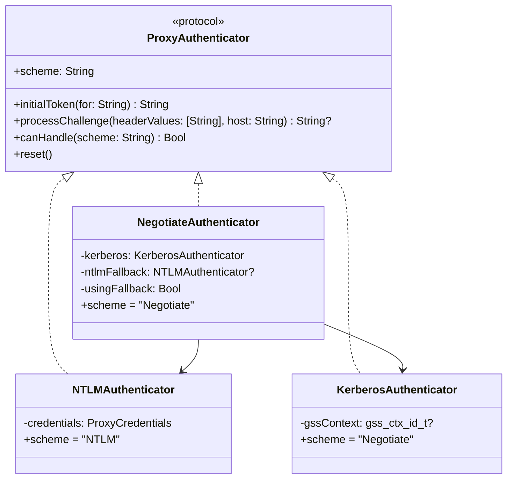
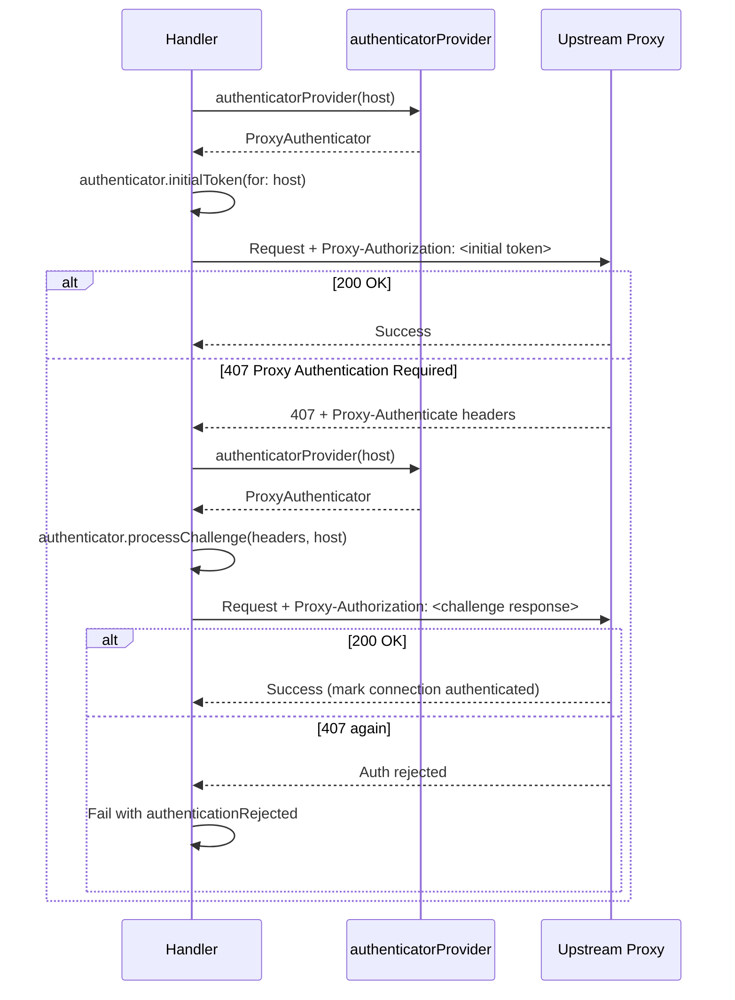

# Authentication Architecture

## Overview

Conduit authenticates with upstream corporate proxy servers using a protocol-based strategy pattern. The system supports two authentication modes:

- **System Negotiated** (default): Kerberos/SPNEGO via macOS GSS.framework, with automatic NTLM fallback
- **NTLMv2**: Direct NTLMv2 challenge-response using credentials stored in the macOS Keychain

The default is System Negotiated because Kerberos requires no password storage or privilege elevation — it uses the system's Kerberos ticket cache, which is populated by `kinit`, macOS Enterprise SSO, or tools like NoMAD/Xcreds.

## Protocol: `ProxyAuthenticator`

All authentication strategies implement a common protocol:

```swift
package protocol ProxyAuthenticator: AnyObject, Sendable {
    var scheme: String { get }
    func initialToken(for host: String) throws -> String
    func processChallenge(headerValues: [String], host: String) throws -> String?
    func canHandle(scheme: String) -> Bool
    func reset()
}
```

This models the two-phase flow shared by both NTLM and Kerberos:

1. **Initial token**: Generate a `Proxy-Authorization` header for the first request (`initialToken(for:)`)
2. **Challenge-response**: On 407, process `Proxy-Authenticate` headers and produce the next token (`processChallenge(headerValues:host:)`)

## Authenticator Implementations



### NTLMAuthenticator

Wraps the existing `NTLMAuth` static methods (Type 1 negotiate, Type 2 challenge parsing, Type 3 authenticate). Requires `ProxyCredentials` (username, domain, workstation, NT hash) loaded from the Keychain.

- `initialToken(for:)` → `"NTLM " + base64(Type1)`
- `processChallenge(headerValues:host:)` → extracts NTLM challenge from headers → `"NTLM " + base64(Type3)`
- Stateless per instance — NTLM state is implicit in the challenge/response exchange

### KerberosAuthenticator

Uses macOS `GSS.framework` to produce SPNEGO tokens via `gss_init_sec_context()`.

- SPN format: `HTTP@<proxy-hostname>` (GSS_C_NT_HOSTBASED_SERVICE)
- SPNEGO mechanism OID: `1.3.6.1.5.5.2`
- Uses the default credential cache (`GSS_C_NO_CREDENTIAL`) — reads from `/tmp/krb5cc_<uid>` or the Keychain-backed ccache
- Mutual authentication flag (`GSS_C_MUTUAL_FLAG`) requested
- Thread-safe: `NSLock` protects the `gss_ctx_id_t` context
- `reset()` calls `gss_delete_sec_context` to clean up

**Token flow:**

```
initialToken(for: "proxy-de.example-corp.com")
  → gss_import_name("HTTP@proxy-de.example-corp.com", HOSTBASED_SERVICE)
  → gss_init_sec_context(nil input) → SPNEGO init token
  → "Negotiate <base64>"

processChallenge(["Negotiate <server-token>"], host:)
  → gss_init_sec_context(server-token input) → mutual auth token (or complete)
  → "Negotiate <base64>" or nil if complete
```

**Swift 6 / GSS.framework notes:**

Several GSS C macros (`GSS_SPNEGO_MECHANISM`, `GSS_C_NT_HOSTBASED_SERVICE`, `GSS_S_CONTINUE_NEEDED`, `GSS_C_NO_CREDENTIAL`) cannot be imported into Swift because they use address-of-struct or complex expressions. The implementation:

- Constructs OID descriptors from their well-known byte values on the stack
- Uses `nonisolated(unsafe)` for the mutable OID byte arrays (safe because they are only read, never mutated at runtime)
- Replaces `GSS_C_NO_CREDENTIAL` with `nil` (optional opaque pointer)
- Checks the error mask (`major & 0xFFFF_0000 == 0`) instead of comparing to `GSS_S_COMPLETE`

### NegotiateAuthenticator

Composite strategy for the `.systemNegotiated` auth mode:

1. Tries `KerberosAuthenticator.initialToken(for:)` first
2. If Kerberos fails (no ticket, expired, KDC unreachable), falls back to `NTLMAuthenticator` if NTLM credentials are available
3. Tracks which strategy is active (`usingFallback` flag) so challenge-response goes to the right authenticator
4. `reset()` clears both and resets the fallback flag

This matches browser behavior: prefer Negotiate/Kerberos, degrade to NTLM if the ticket is unavailable.

## Provider Closure

The authenticator is injected via a host-scoped closure:

```swift
authenticatorProvider: (String) throws -> ProxyAuthenticator
```

The `String` parameter is the upstream proxy hostname (e.g., `proxy-de.example-corp.com`). This is necessary because:

- Kerberos SPNs are per-host (`HTTP@host`)
- Different upstream proxies could theoretically use different auth strategies
- Makes the factory independently testable (assert which host was requested)

The closure flows through:

```
AppState
  → LocalProxyServer
    → ConnectionPool → HTTPExchangeHandler
    → CONNECTCoordinator → RawConnectHandshakeHandler
```

`AppState` dispatches based on `config.authMode`:

```swift
switch config.authMode {
case .systemNegotiated:
    // Kerberos-first with optional NTLM fallback from Keychain
    let ntlmFallback = try? credentialManager.loadCredentials(for: config)
        .map { NTLMAuthenticator(credentials: $0) }
    return NegotiateAuthenticator(ntlmFallback: ntlmFallback)
case .ntlmv2:
    // Pure NTLM, credentials required
    let credentials = try credentialManager.loadCredentials(for: config)
    return NTLMAuthenticator(credentials: credentials)
}
```

## 407 Challenge Flow

Both `HTTPExchangeHandler` (HTTP proxy requests) and `RawConnectHandshakeHandler` (CONNECT tunnels) follow the same protocol-driven flow:



Key differences from the old NTLM-hardcoded flow:
- `NTLMAuth.negotiateMessage` → `authenticator.initialToken(for:)`
- `NTLMAuth.extractChallenge` + `NTLMAuth.authenticateMessage` → `authenticator.processChallenge(headerValues:host:)`
- Scheme prefix (`"NTLM "` vs `"Negotiate "`) is handled inside the authenticator, not the handler

## Credential Storage

NTLM credentials are stored in the macOS Keychain via `CredentialManager` → `KeychainStore`:

```
ProxyCredentials {
    username: String
    domain: String
    workstation: String
    ntHash: Data        // MD4 hash of the password, never plaintext
}
```

Keychain account key: `"<domain>|<username>|<profileName>"`.

Kerberos mode does not use `CredentialManager` at all — it reads from the system Kerberos ticket cache managed by macOS.

## Configuration

`ProxyConfig.authMode` is an `AuthenticationMode` enum:

```swift
enum AuthenticationMode: String, Codable {
    case ntlmv2
    case systemNegotiated  // default
}
```

- **New installs** default to `.systemNegotiated` — no password prompt on first run
- **Existing installs** with explicit `"authMode": "ntlmv2"` in saved config preserve that value
- The `Codable` decoder uses `decodeIfPresent` with fallback to the default

## UI Integration

### Settings Auth Tab

Conditionally renders based on `authMode`:

- **System Negotiated**: Kerberos info panel explaining ticket-based auth. NTLM fallback credentials in a disclosure group.
- **NTLMv2**: Standard username/domain/workstation fields with password save/clear.

### Module Card Badge

The proxy module card on the dashboard shows an auth mode badge:
- "Kerberos" (purple) for `.systemNegotiated`
- "NTLMv2" (orange) for `.ntlmv2`

### Setup Wizard

Branches by auth mode:
- **System Negotiated (default)**: No password prompt. Kerberos info. Optional NTLMv2 fallback in a disclosure group. VPN DNS auto-detection step.
- **NTLMv2**: Password entry with confirmation. DNS server entry.

## Future: Inbound Gateway Auth

The `ProxyAuthenticator` protocol is designed to support server-side authentication for the gateway strict mode feature:

- A future `InboundAuthHandler` (NIO `ChannelHandler` in the pipeline before `HTTPProxyHandler`) would challenge connecting clients with `Proxy-Authenticate: Negotiate` or `NTLM`
- It would use GSS `gss_accept_sec_context` to validate client tokens
- `strictMode` in `ProxyConfig` already exists and gates this handler's insertion
- The protocol's `processChallenge` flow works for server-side validation with a server-role authenticator

No code for this exists yet, but the architecture doesn't require protocol changes to support it.

## Testing

18 dedicated tests in `ProxyAuthenticatorTests.swift`:

- `NTLMAuthenticator`: initial token format, challenge handling, scheme matching
- `KerberosAuthenticator`: scheme matching, reset safety
- `NegotiateAuthenticator`: dual-scheme handling, NTLM fallback when no ticket, failure without fallback
- `MockAuthenticator`: verifies protocol contract for handler integration tests
- Config defaults: `.systemNegotiated` default, explicit `.ntlmv2` preserved, missing key defaults

All existing NTLM tests (in `NTLMAuthTests.swift`) continue to pass — the `NTLMAuthenticator` wrapper is a pure delegation layer over the unchanged `NTLMAuth` static methods.
