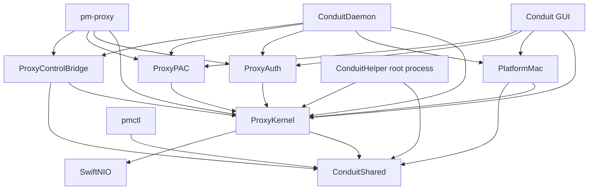

# Conduit architectural and security review

**Remediation update:** S01–S03 have been fixed and validated with CLT build/headless checks. See [the remediation record](security-fixes-2026-09-09.md) for changed behavior, evidence, and the remaining XCTest limitation. Findings below describe the original reviewed revision.
Review date: 2026-09-09. Revision: `960901b17c013ce2e45394fbdce313df3a597358`.

## Assessment and scope

The current module split is a useful foundation. Keep Swift/NIO and the existing kernel, platform, auth, and PAC separation. The highest-value work is tightening the contracts between those components: routing authority, credential eligibility, configuration failure, privileged operations, and connection completion. Several controls exist in one execution path but are absent or different in another.

Three source-confirmed issues deserve attention first: a PAC-selected unknown proxy can inherit configured credentials; a malformed configuration silently becomes a default configuration permitting direct routing; and binding a specific non-loopback address avoids the gateway filtering requirement. The installed helper's trust model also grants privileged networking authority to every process of the console user, rather than identifying Conduit.

This is a risk-based source review, not a completed penetration test or an assertion that every line is safe. Inspection covered the package graph, request routing, credential selection, helper/control transport, relevant parsing and DNS paths, lifecycle reconciliation, persistence, observability, tests, installation, and CI. The tree contains 173 Swift source files (45,695 lines) and 116 Swift test/support files (29,703 lines). The full source corpus was inventoried; security-sensitive paths were read selectively and traced across their callers.

The initial working tree was clean. This review changes documentation only. No company configuration, credentials, VPN, Keychain entries, installed helper, or system network settings were accessed. No external service was sent a test payload.

### Validation performed

- Recorded the revision, module/file inventory, dependency lockfile, existing audit plan, threat model, and CI definitions.
- Traced the findings below through current source and relevant existing tests. “High confidence” means the source establishes the behavior; it does not mean an end-to-end exploit was run.
- Confirmed `xcode-select -p` selects `/Library/Developer/CommandLineTools`; the available Swift reports 6.3.3. The repository-required Xcode invocation fails with `missing DEVELOPER_DIR path: /Applications/Xcode.app/Contents/Developer`. No package build, XCTest run, simulator run, or sanitizer run was performed.
- Ran an isolated Python/Darwin `socketpair` probe: a 0.2-second `SO_RCVTIMEO` allowed five bytes arriving every 0.12 seconds, taking 0.625 seconds overall without timeout. This confirms the inactivity-timeout premise of S07, not execution of Conduit itself.
- Checked three relevant published SwiftNIO advisories against the pinned version; see dependency notes below. This was not a comprehensive dependency vulnerability scan.

The reproduction scenarios below are proposed checks for Xcode/CI, not claimed passing or failing test executions.

## Findings by priority

Severity describes impact under the stated preconditions, not default exposure. High findings can change traffic/credential trust boundaries. Medium findings affect constrained confidentiality, availability, routing reliability, or audit integrity. S04 is an explicit security-policy gap; the other entries identify concrete code behavior.

| ID | Severity | Finding | Preconditions |
| --- | --- | --- | --- |
| S01 | High | Unknown PAC upstream inherits saved credentials | PAC-controlled endpoint; usable saved credentials |
| S02 | High | Config read/decode failure silently selects direct-capable defaults | Invalid/unreadable config at startup or reload |
| S03 | High | Specific LAN bind skips gateway filtering | Non-loopback `proxy.host`, gateway mode off; network reachability |
| S04 | High, policy gap | Console UID is sufficient for privileged helper commands | Helper installed; local process under console UID |
| S05 | Medium | SOCKS5 PAC `DIRECT` overrides forced-proxy rules | SOCKS enabled; matching force rule; PAC returns DIRECT |
| S06 | Medium | Query secrets reach ordinary logs and raw snapshots | Query-bearing HTTP request; applicable log/snapshot sink |
| S07 | Medium | Slow helper peer can block service and the app indefinitely | Access to helper socket; client drips bytes |
| S08 | Medium | SOCKS5 bypasses the HTTP inbound connection cap | SOCKS enabled; reachable listener |
| S09 | Medium | PAC download size ceiling applies only to curl path | Large HTTPS/file PAC response |
| R01 | Medium | HTTP forwarding ignores remaining PAC upstreams | First PAC proxy unavailable; later proxy healthy |
| R02 | Medium | Audit records can report failed requests as success | Audit logging enabled |
| R03 | Medium | Bounded log files have unbounded producer queues and full-file rewrites | Sustained events/audit traffic or slow storage |
| R04 | Medium | Legacy helper operations ignore process failure | `networksetup` exits nonzero after successful launch |
| R05 | Medium | Listener configuration changes close active HTTP streams | Active pooled HTTP exchange during listener restart |

### S01 — PAC routing authority also grants credential authority

**Evidence:** [HTTPProxyHandler.swift:385](../Sources/ProxyKernel/Proxy/HTTPProxyHandler.swift#L385) creates an `UpstreamProxy` for PAC endpoints absent from configured upstreams. [AuthenticatorFactory.swift:46](../Sources/ProxyAuth/AuthenticatorFactory.swift#L46) falls back to `config.upstreams.first` when lookup fails. [CredentialManager.swift:60](../Sources/PlatformMac/CredentialManager.swift#L60) ignores the requested upstream and returns profile credentials. [CONNECTHandler.swift:280](../Sources/ProxyKernel/Proxy/CONNECTHandler.swift#L280) passes only the proxy hostname to the factory, then sends the generated initial token; subsequent 407 challenges use the same authenticator.

A PAC returning `PROXY untrusted.example.test:8080` can therefore select both a network destination and the opportunity to authenticate there with the active profile's credentials. Explicit NTLM mode establishes this path directly. Negotiated mode reaches it when an allowed Kerberos failure triggers lazy NTLM fallback. It does not require extracting the NT hash or plaintext password: the untrusted endpoint can obtain authentication exchanges. Relay consequences depend on the receiving services' protections; Microsoft describes the role of EPA/channel binding in preventing unintended-server authentication in its [NTLM relay guidance](https://www.microsoft.com/en-us/msrc/blog/2024/12/mitigating-ntlm-relay-attacks-by-default).

The production app supports plaintext HTTP PAC fetching, so a compromised PAC source or a network attacker able to alter that fetch is a relevant precondition. A legitimately administered PAC may need dynamic proxies; dynamic routing should not automatically grant credential access. Host-only matching also loses port identity even though the factory documentation claims host:port matching.

**Fix direction:** pass a typed upstream identity through authentication; separately authorize credential use for a canonical host/port and profile. Unknown PAC endpoints should receive no saved credentials unless explicitly trusted. Keep lazy NTLM fallback and reuse one authenticator per handshake. Allow an explicit trusted proxy group when several corporate proxies intentionally share credentials.

**Reproduction:** configure one synthetic trusted upstream and an in-memory recording credential provider; have a fake PAC select a second fake proxy. Assert no credential lookup/token generation for the second endpoint without a grant. Cover two ports on one hostname, case normalization, NTLM mode, and permitted Kerberos fallback. Confidence: high; network/credential reproduction pending.

### S02 — Malformed configuration becomes a valid direct-capable configuration

**Evidence:** [ProxyConfigPersistence.swift:75](../Sources/ProxyKernel/Support/ProxyConfigPersistence.swift#L75) conflates missing files, read errors, and JSON decode failures, returning `GenericDefaults` with an empty warning list. [ConfigDefaults.swift:33](../Sources/ProxyKernel/Models/ConfigDefaults.swift#L33) supplies no upstreams. [PMProxy.swift:251](../Sources/pm-proxy/PMProxy.swift#L251) loads and applies that result on reload, then logs completion. [DaemonRuntimeHost.swift:408](../Sources/ConduitDaemon/DaemonRuntimeHost.swift#L408) similarly replaces its configuration. [ProxyOrchestrator.swift:2142](../Sources/ProxyKernel/Proxy/ProxyOrchestrator.swift#L2142) and [DirectModeCause.swift:98](../Sources/ProxyKernel/Proxy/DirectModeCause.swift#L98) make no-upstream/off-VPN states direct-capable even with strict mode enabled.

A truncated edit, wrong JSON type, or unreadable existing file can remove routing policy without reporting the load failure. Default values pass subsequent validation: validation cannot recover the lost distinction between intentionally empty configuration and failure to read policy. Exact listener changes on reload depend on the previous configuration and CLI overrides, but the unsafe policy substitution is unconditional.

**Fix direction:** distinguish first-run absence, valid config, unsupported schema, decode error, and I/O failure. Preserve the last valid configuration on reload and return a structured failure to control clients. For an explicitly supplied invalid config at startup, fail startup; reserve defaults for intentional first-run/minimal mode. Do not increment an applied-config generation on rejected reload.

**Reproduction:** start an isolated runtime with synthetic forced-proxy rules, corrupt its scratch config, then reload. Assert unchanged policy/generation, a failure response/event, and zero direct connections. Test read failure separately. Confidence: high.

### S03 — Binding a LAN address does not enable gateway protections

**Evidence:** [ConfigValidation.swift:140](../Sources/ProxyKernel/Models/ConfigValidation.swift#L140) rejects wildcard binds without gateway mode, but [its wildcard predicate](../Sources/ProxyKernel/Models/ConfigValidation.swift#L322) recognizes only `0.0.0.0`, `::`, and `[::]`. A specific address such as `192.168.50.10` passes the host-token check. [LocalProxyServer.swift:516](../Sources/ProxyKernel/Proxy/LocalProxyServer.swift#L516) and [SOCKS5Server.swift:61](../Sources/ProxyKernel/Proxy/SOCKS5Server.swift#L61) install `ClientIPFilter` only in gateway mode. The DNS wildcard restriction has the same address-class gap.

If that address exists on the machine and is reachable, remote clients can use the listener without the gateway allowlist; metadata/loopback protection also receives `gatewayMode == false`. Loopback defaults remain safe from this particular remote exposure. This is an incomplete version of the previous audit's wildcard-bind fix, not a claim that a fresh install is publicly reachable.

**Fix direction:** require verified loopback binding outside explicit gateway mode, including the resolved address when hostnames are accepted. Prefer literals or resolve-and-validate before binding the exact validated address. Apply equivalent policy to each DNS/tunnel/listener surface according to its intended exposure.

**Reproduction:** pure validation tests for IPv4/IPv6 non-loopback literals and hostname resolution to non-loopback; then an isolated listener test with injected address classification. A real LAN test is unnecessary on these personal machines. Confidence: high.

### S04 — Helper authentication identifies a user, not an authorized application

**Evidence:** [HelperDaemon.swift:63](../Sources/ConduitHelper/HelperDaemon.swift#L63) creates a root:staff socket with mode 0660. [peerRefusal](../Sources/ConduitHelper/HelperDaemon.swift#L225) allows any non-root peer whose effective UID matches the current console user. [processRequest](../Sources/ConduitHelper/HelperDaemon.swift#L146) then exposes resolver writes/removals, system proxy/PAC/DNS changes, and privileged loopback relays. The daemon does not verify caller code identity or a separate authorization grant. Installer files are root-owned after installation, which is a useful separate protection.

This grants every unsandboxed process with socket access under that user ongoing privileged networking authority after the helper is installed. That includes scripts or compromised development tooling. It is not evidence of arbitrary root code execution, and UID matching is still useful protection against other users' command execution. Treating all same-user processes as fully trusted is a policy choice, but it should be explicit for a tool used on a development laptop.

**Fix direction:** define the authorized-caller model and narrow operation scope. For signed distribution, evaluate an OS-supported authenticated IPC design with caller identity tied to a stable code-signing requirement; retain explicit per-operation validation. Keep development authorization separate. Avoid a reusable secret readable by every same-user process as the sole replacement control. Record peer identity/action/result in helper-side auditing: the app-side audit wrapper cannot observe a process that bypasses the app.

**Verification:** authorize a fake expected caller, reject an unexpected same-UID caller, and verify peer identity and action results without running privileged commands. Actual signed-helper acceptance requires later macOS integration validation. Confidence: high for current authorization scope; exploitability beyond those commands is not claimed.

### S05 — SOCKS5 ignores force-proxy precedence when PAC says DIRECT

**Evidence:** [SOCKS5Server.swift:280](../Sources/ProxyKernel/Proxy/SOCKS5Server.swift#L280) calls `shouldEvaluatePAC(..., forceProxy: false)` unconditionally. [finishRequestRouting](../Sources/ProxyKernel/Proxy/SOCKS5Server.swift#L333) ORs `pacBypass` with the no-proxy result, so a force rule cannot veto PAC DIRECT. The [HTTP path](../Sources/ProxyKernel/Proxy/HTTPProxyHandler.swift#L100) actually computes force matching and suppresses PAC evaluation when forced.

With normal upstream routing, strict mode, a matching forced host, and a DIRECT PAC response, HTTP and SOCKS5 choose different paths. An application changing its proxy protocol can bypass the intended forced-proxy rule.

**Fix direction:** compute one route plan with explicit precedence, shared by HTTP, CONNECT, and SOCKS5. Add a protocol parameter only for a real semantic difference, not a second policy implementation.

**Reproduction:** fake DIRECT PAC, force `service.example.test`, strict mode, healthy fake upstream, direct origin connection counter. Both HTTP CONNECT and SOCKS5 must use upstream or refuse, and never contact the direct origin. Confidence: high.

### S06 — Query-string credentials are redacted for audit targets, but not all other sinks

**Evidence:** [SensitiveValueSanitizer.swift:26](../Sources/ProxyKernel/Support/SensitiveValueSanitizer.swift#L26) drops queries only in `auditTarget`; `sanitize` masks userinfo/headers/bearer/long token patterns but retains ordinary short query values. [HTTPProxyHandler.swift:559](../Sources/ProxyKernel/Proxy/HTTPProxyHandler.swift#L559) logs complete direct URLs, and warning/error paths also interpolate `head.uri`, for example [line 124](../Sources/ProxyKernel/Proxy/HTTPProxyHandler.swift#L124). [ActiveConnectionInfo](../Sources/ProxyKernel/Models/ProxyStatus.swift#L134) stores the raw destination supplied at [HTTPProxyHandler.swift:203](../Sources/ProxyKernel/Proxy/HTTPProxyHandler.swift#L203). Raw runtime snapshots are serialized by the CLI. [AppLogStore.swift:188](../Sources/Conduit/App/AppLogStore.swift#L188) forwards log text to file/stderr and public unified-log fields.

A request containing `?api_key=short-secret` is not caught by the long-token heuristic. Normal direct-request logging needs an enabled info level; warning paths and raw active snapshots do not have that same condition. The diagnostic bundle's explicit snapshot redaction is a useful existing mitigation and does not make raw snapshots or ordinary exported logs safe.

**Fix direction:** separate the wire request target from a safe observable destination. Strip queries/fragments before durable logging/snapshots and use structured host/port fields where possible. Reuse one sanitization contract across kernel logs and shared diagnostics. Do not change the URI sent to the destination.

**Reproduction:** send synthetic short query tokens through success, error, oversize-body, active-snapshot, and export paths; assert the exact token never appears in any sink while the origin receives the unchanged URI. Confidence: high.

### S07 — Helper timeouts do not bound a transaction or protect the UI

**Evidence:** [HelperDaemon.swift:82](../Sources/ConduitHelper/HelperDaemon.swift#L82) handles clients serially; even refused peers are drained before replying. [readLine](../Sources/ConduitHelper/HelperDaemon.swift#L188) reads one byte at a time up to 1 MiB. [setReadTimeout](../Sources/ConduitHelper/HelperDaemon.swift#L235) sets a five-second inactivity timeout. [HelperToolPrivilegeClient.sendRequest](../Sources/PlatformMac/HelperPrivilegeClient.swift#L534) uses synchronous connect/write/read without a transaction deadline. Its own file comments state callers execute synchronously on MainActor.

A peer sending a byte before every inactivity timeout can monopolize the helper for an impractically long time, while legitimate app calls wait. A socket-permitted non-console user can also do this via the refusal-drain path. Apple's [socket-option documentation](https://developer.apple.com/library/archive/documentation/System/Conceptual/ManPages_iPhoneOS/man2/setsockopt.2.html) describes `SO_RCVTIMEO` as an inactivity timer; the local socketpair experiment confirmed that premise.

**Fix direction:** impose a monotonic total read/operation/write deadline and a bounded number of concurrently serviced peers; reject unauthorized peers without an unbounded drain. Move helper communication and subprocess waiting off MainActor, expose cancellation, and return a typed timeout. Add write deadlines too. Review `pm-proxy`'s serial control server and `DaemonClient` for the equivalent lack of whole-transaction deadlines.

**Reproduction:** fake helper endpoint plus dripped request/response bytes; verify timeout despite continued progress and verify an independent client can still receive service. Use fake privileged operations, not the installed daemon. Confidence: high; timeout premise experimentally confirmed, Conduit runtime reproduction pending.

### S08 — SOCKS5 has no equivalent inbound admission cap

**Evidence:** [LocalProxyServer.swift:473](../Sources/ProxyKernel/Proxy/LocalProxyServer.swift#L473) counts HTTP clients and rejects those above `inboundConnectionMaxLimit`. [SOCKS5Server.start](../Sources/ProxyKernel/Proxy/SOCKS5Server.swift#L55) creates a separate listener with no corresponding admission counter. Its [greeting state](../Sources/ProxyKernel/Proxy/SOCKS5Server.swift#L182) waits for bytes without a handshake deadline. Upstream authentication/pool limits occur later and do not bound idle accepted sockets.

Clients can accumulate idle SOCKS connections until process/OS resources become the effective cap. The setting advertised as an inbound connection maximum therefore does not bound total proxy admission. SOCKS is disabled by default; gateway allowlisting, when enabled, narrows who can trigger it but does not supply a cap.

**Fix direction:** share an admission-budget object across HTTP and SOCKS listeners, reserve before handler/task creation, and release on channel close. Add a finite protocol-negotiation deadline and separate active-session limits if needed.

**Reproduction:** set a small shared cap, open a mix of HTTP and SOCKS sockets without greetings, and assert admission rejection and eventual slot release without exhausting the real host. Confidence: high.

### S09 — HTTPS/file PAC loading bypasses the documented fetch ceiling

**Evidence:** [AppState.curlPACFetcher](../Sources/Conduit/App/AppState.swift#L499) has an explicit output ceiling, exercised by `PACFetchCeilingTests`. [CFPACEvaluator.fetchPAC](../Sources/ProxyPAC/CFPACEvaluator.swift#L363) reads file PACs as a complete string and HTTPS PACs with `session.data(from:)`, with no application byte ceiling. It also discards the HTTP response/status before installing the fetched content as a new evaluator.

A large PAC response can consume memory beyond the curl-path bound before evaluation limits help. An HTTP error body can replace a good evaluator and only fail when evaluated because evaluator construction does not parse-test the script. The existing ceiling tests exercise curl directly, so they cannot detect this gap.

**Fix direction:** make maximum PAC bytes a shared fetch contract, enforce it during streamed reads rather than after allocating the body, check HTTP status, bound file reads, and retain the last valid evaluator on fetch/validation failure. Define redirects and accepted schemes explicitly. Apply the same bounded-response discipline to DoH URLSession fetches, which also buffer full responses.

**Reproduction:** stub successful HTTPS, chunked oversized HTTPS, error-status HTML, and oversized file responses through the production evaluator interface. Assert bounded reading and preservation of prior routing rules. Confidence: high.

### R01 — Ordinary HTTP does not traverse the PAC failover chain

**Evidence:** [HTTPProxyHandler.swift:505](../Sources/ProxyKernel/Proxy/HTTPProxyHandler.swift#L505) passes only `pacResult.proxyChain.first` into streaming exchange. [ConnectionPool.swift:240](../Sources/ProxyKernel/Proxy/ConnectionPool.swift#L240) makes one selected-proxy attempt and returns its failure. The [handler failure path](../Sources/ProxyKernel/Proxy/HTTPProxyHandler.swift#L522) may choose DIRECT or return an error; it never tries the second PAC proxy. [CONNECTCoordinator](../Sources/ProxyKernel/Proxy/CONNECTHandler.swift#L58) does walk the PAC chain.

For `PROXY A; PROXY B; DIRECT`, an unavailable A prevents ordinary HTTP from using healthy B. A forced PAC first entry also bypasses normal pool selection on later requests. Strict mode returns failure; non-strict mode can jump to DIRECT when the PAC chain allows it. This qualifies the product's failover guarantee by protocol.

**Fix direction:** execute the shared ordered route plan with an explicit replay boundary. Connect failures before sending request bytes can advance safely; requests with uncertain side effects or responses already emitted must not be blindly replayed. Preserve the existing streaming-interruption protection.

**Reproduction:** fake A refuses TCP, B serves a request, direct-origin dial is counted. Plain GET must use B. Add POST/partial-response cases to prove retry safety. Confidence: high.

### R02 — Audit completion is inferred from UI connection removal and can report false success

**Evidence:** [ProxyOrchestrator.recordConnectionCloseForAudit](../Sources/ProxyKernel/Proxy/ProxyOrchestrator.swift#L460) always emits `outcome: .success`, with no client address/PAC decision and with the initially recorded upstream. [HTTPProxyHandler.swift:203](../Sources/ProxyKernel/Proxy/HTTPProxyHandler.swift#L203) reports a connection opened before attempting the exchange; [its failure path](../Sources/ProxyKernel/Proxy/HTTPProxyHandler.swift#L530) reports the same connection closed after failure. [The orchestrator callbacks](../Sources/ProxyKernel/Proxy/ProxyOrchestrator.swift#L1024) turn that close into an audit record. Successful request callbacks receive an endpoint, but the [orchestrator discards it](../Sources/ProxyKernel/Proxy/ProxyOrchestrator.swift#L1054).

The comment claiming unsuccessful connection attempts never reach this path is contradicted by the caller. A failed request can be recorded as successful, and failover can leave the originally selected endpoint recorded instead of the endpoint actually used. Zero/missing activity can also make duration and byte metadata misleading. Audit logging is opt-in, so this is an integrity defect of that feature, not a default credential exposure.

**Fix direction:** emit a typed request/session completion record from the execution path, containing actual route, outcome, byte counts, and close time. Derive UI state and audit records from those lifecycle events rather than reconstructing audit truth from a presentation snapshot. Distinguish request records from TCP-session records.

**Reproduction:** failed connect, auth rejection, successful failover, partial response, cancellation, and normal close. Assert exact outcomes and actual upstreams via the real callbacks, not only manually supplied `ActiveConnectionInfo`. Confidence: high.

### R03 — Disk caps do not bound logging work or memory

**Evidence:** [FileConnectionAuditSink.record](../Sources/ProxyKernel/Support/StandardConnectionAuditSinks.swift#L84) queues one closure per record without admission limits. [append](../Sources/ProxyKernel/Support/StandardConnectionAuditSinks.swift#L124) reads, copies, trims, and atomically rewrites the whole existing file for each row. [RuntimeEventFileWriter](../Sources/ProxyKernel/Support/RuntimeEventFileWriter.swift#L25) has the same structure with a smaller file cap. `flush()` waits for the entire queue.

At the default full 10 MiB audit size, each additional row causes approximately a full-file rewrite rather than a row append. Producers can outrun disk processing, growing the queued records/closures and making shutdown flush slow. The disk-size cap alone does not satisfy bounded-resource requirements. Independently, [ConsoleLogSink](../Sources/ProxyKernel/Support/StandardLogSinks.swift#L34) writes synchronously to stderr from arbitrary callers, so a full/unread pipe can block an event loop.

**Fix direction:** bounded batched append/rotation, a defined overload policy with dropped-record metrics, and bounded shutdown draining. Separate disk retention from queue capacity. Move potentially blocking log output behind the same bounded sink interface.

**Reproduction:** injected slow writer with a small queue budget; assert bounded queue size, visible drops/backpressure, bounded flush, and forward progress on NIO loops. Measure actual write bytes per record. Confidence: high for algorithm/absence of bounds; throughput impact unmeasured.

### R04 — Legacy helper operations can return success when nothing was applied

**Evidence:** [HelperTool.swift:59](../Sources/ConduitHelper/HelperTool.swift#L59), [line 67](../Sources/ConduitHelper/HelperTool.swift#L67), and [line 208](../Sources/ConduitHelper/HelperTool.swift#L208) discard `networksetup` termination status. The daemon returns `.ok()` if `HelperTool.run` does not throw. Newer restore operations use `runChecked`, but [its comment](../Sources/ConduitHelper/HelperTool.swift#L257) explicitly leaves older operations unchanged and refers to issue #59.

Launch success is not operation success. A nonexistent/changed service or an OS refusal can be reported to the runtime as a completed write, undermining reconciliation and recovery. This is an existing acknowledged gap, not presented as a newly discovered issue. Issue #59's remote status was not checked.

**Fix direction:** use checked process results with bounded concurrent stdout/stderr draining and deadlines. Model any justified benign nonzero outcomes explicitly; do not rely on blanket leniency. The newer `runChecked` reads stdout and stderr sequentially, so its comment does not establish safety against both pipes filling.

**Reproduction:** injected subprocess runner returning failure for each legacy command; assert helper failure and retained recovery state. Validate actual `networksetup` exit behavior later on a dedicated test environment. Confidence: high.

### R05 — Configuration-driven listener restart preserves CONNECT, not all active traffic

**Evidence:** [ProxyOrchestrator.swift:777](../Sources/ProxyKernel/Proxy/ProxyOrchestrator.swift#L777) restarts for host/port/gateway/SOCKS changes using `.allButDedicated`. [ConnectionPool.swift:522](../Sources/ProxyKernel/Proxy/ConnectionPool.swift#L522) closes every non-dedicated connection, including `inUse` pooled HTTP exchanges. [ConnectionPoolTests.swift:162](../Tests/ConduitTests/ConnectionPoolTests.swift#L162) explicitly requires this behavior.

A long HTTP response/download can be cut off by a listener configuration change. CONNECT preservation is implemented; preservation of in-use pooled exchanges is not. The instruction to never close active upstream channels and its suggestion to use `.allButDedicated` are mutually inconsistent for this path.

**Fix direction:** keep the old pool alive to drain existing exchanges while the new listener/pool admits new work, with an explicit bounded retirement policy. Remove the default `.all` argument from APIs used for both restart and termination so call sites must state intent. If interruption is a deliberate product choice, document it precisely and reconcile the invariant with tests.

**Reproduction:** start a slow plain-HTTP response and a CONNECT tunnel, change the SOCKS/listener setting, and assert the chosen continuity policy separately for both streams. Confidence: high; this is documented/tested current behavior conflicting with the broader invariant.

## Architectural assessment

### Current runtime and dependency boundaries

The manifest has six library targets and eleven executable targets. The important direct edges are:

This is a selected dependency graph, not an IPC/data-flow diagram. Additional direct Shared imports and diagnostic executables are omitted for readability. The actual runtime flow is client listener → HTTP/SOCKS handler → routing decision → direct connection or upstream pool/CONNECT coordinator → connection-scoped authenticator → byte relay. The app and daemon separately compose the same kernel with platform managers; privileged system changes cross the helper socket.

**Keep:** protocol-injected auth/PAC/privilege effects, `ProxyControlBridge`, structured configuration sections/diffs, the shared reconciler and prior-state journal, connection-scoped authenticators, `SecretBytes`, DNS admission and response-question checks, metadata validation, async PAC routing, and the existing fake-machine and simulator approach. These make the proposed fixes feasible without a rewrite. Source review found those mechanisms; this review does not certify their complete correctness.

### Recommended internal API changes

| Boundary | Current problem | Recommended contract |
| --- | --- | --- |
| Routing | HTTP/SOCKS/CONNECT duplicate precedence and failover | `RoutePlan` with ordered candidates, explicit direct permission, reason, and config generation; one planner, protocol-specific executors |
| Authentication | String host and profile fallback erase identity | `UpstreamIdentity` plus explicit credential-use authorization; separate routing destination from credential scope |
| Configuration | Value-or-default masks operational errors | Typed load result; validated candidate; atomic acceptance; last-good rollback/rejection |
| Privilege | `execute(operation, values: [String])` duplicates parsing and validation across shell/client/helper | Typed internal operation payloads and result semantics; translate at the existing versioned wire boundary |
| Lifecycle | Broad stop API is reused for restart; two host compositions can drift | Distinct terminate/drain/reconfigure intent, shared host behavior fixtures, explicit ownership and completion |
| Observability | Completion is reconstructed from UI state; route details exist as log strings | Typed session/request lifecycle events; UI/audit/logs become consumers of the same facts |
| Resource use | Per-file/per-request caps omit aggregate admission and queued work | Shared budgets for accepted sockets, pending requests, spooled bytes, PAC/DoH work, and log records |

These are suggested contracts, not a request to add all named types immediately. Introduce them where they eliminate a reproduced defect. No new top-level dependency or public API is necessary for the first fixes. Any later helper wire change must follow the repository's explicit versioning/approval requirement.

### Daemon migration remains incomplete

[ConduitDaemon.swift:92](../Sources/ConduitDaemon/ConduitDaemon.swift#L92) explicitly remains resident without a control socket; `pm-proxy` owns the currently implemented control server. The GUI still owns its local runtime. Consequently, sharing DTOs and providing `DaemonClient` does not yet make the menu bar a daemon client.

Finish this as a separate migration after the security fixes: move reusable bounded control transport out of the headless executable, compose it into the user daemon, verify single ownership and recovery, and then make the GUI consume daemon snapshots. Do not repurpose the root helper as the full proxy/auth host. Keep the headless runtime independently runnable with fake credentials and platform effects absent.

The app's plaintext PAC fetcher lives in `AppState`; the daemon constructs the default PAC evaluator without that injection. Move the platform fetch capability out of the view/application composition so supported fetch behavior can be tested consistently across hosts. An HTTP PAC supported by the GUI is not automatically supported by the production daemon.

### Module fences and documentation need executable checks

`pm-proxy` has no `PlatformMac` dependency, which is useful. However, that absence alone does not prove absence of all system effects. The kernel imports Darwin in several files, includes filesystem-backed temporary-body management, and depends on `ConduitShared`; the root helper depends on the entire kernel for relays and therefore reaches NIO. These facts are more precise than the current “Foundation + NIO only” and thin-helper descriptions.

The inspected PR workflow runs build/test/performance gates; it contains no explicit import/dependency allowlist. Add a small static architectural gate and choose the actual intended kernel platform contract, including Darwin. Reconsider extracting a narrow relay target only if it reduces the privileged host's auditable dependency surface enough to justify another target; a linked dependency alone is not proof all its code is attack-reachable.

The largest files are `ProxyOrchestrator` (2,557 lines), `ConnectionPool` (1,722), `AppState` (1,545), `HTTPProxyHandler` (1,432), and `LocalDNSForwarder` (1,246). Their size matters because policy, transport, and accounting are interleaved, as the findings demonstrate. Extract routing, exchange completion, and resource ownership along those boundaries rather than splitting files merely to reduce line counts.

## Security decisions to make explicit

**Direct routing is not a VPN kill switch.** Current tests intentionally allow direct behavior in off-VPN/no-upstream states even with strict mode. Unknown VPN state plus unsuccessful upstream probes can also be classified as `vpnDisconnected`. Keep this behavior if it matches the intended daily-driver experience, but document that `strictMode` does not guarantee all traffic stays on VPN/proxy. Any future mandatory-proxy policy needs an explicit setting and consistent enforcement across protocol handlers, local PAC, and DNS. Conduit only controls traffic applications send through its listeners or managed integrations; it is not a system-wide packet filter.

**DNS privacy depends on explicit domain classification.** The forwarder keeps recognized internal domains on its internal-server path and does not apply public DoH fallback in that branch ([LocalDNSForwarder.swift:548](../Sources/ProxyKernel/Network/LocalDNSForwarder.swift#L548)). Other domains can fall back to public DoH after internal failure/NXDOMAIN. Incomplete internal-domain policy can therefore expose names to the configured DoH provider. Decide whether that fallback is permitted; verify using synthetic suffixes here and company-approved procedures later.

**Upstream transport and NTLM assurance are separate from target HTTPS.** Target TLS inside CONNECT does not by itself authenticate/protect the outer proxy auth exchange. The pool connects to host/port with raw NIO TCP; this review did not find a TLS-to-proxy configuration. Treat signed-distribution Keychain ACLs, Kerberos mutual-auth completion, NTLM MIC/channel binding/EPA interoperability, and permitted fallback as focused follow-up work. Do not assume storing an NT hash makes it a low-sensitivity secret, or that using CFNetwork alone proves a PAC process sandbox.

**Aggregate laptop limits need tuning.** Defaults permit 10,000 inbound HTTP connections, 16 MiB buffered bodies, and 256 MiB spooled bodies per request. Those individually finite values are not a practical total memory/disk budget for a laptop. Establish measured aggregate budgets and protect early request/handshake stages; do not choose limits solely from the maximum supported session count.

**File confidentiality is partly inherited.** Spool creation explicitly requests 0600, but config/snapshot/event/audit directory/file creation generally relies on filesystem defaults/umask and inherited directories. Require private state directories and explicit file modes where they carry network topology, query-bearing data, or recovery state. Validate ownership/symlink behavior on existing paths, including custom state directories. Cross-user disclosure was not demonstrated in this review.

## Tests, dependencies, and remaining validation

The repository has relevant regression suites for auth, header forwarding, PAC, DNS validation, relay security, lifecycle recovery, and helper contracts. Treat their assertions as evidence of intended behavior, not blanket proof of the implemented boundary. Examples of gaps are curl-only PAC ceiling tests, HTTP-only admission limits, helper argument tests without real daemon dispatch, and manually constructed audit records rather than failure-to-completion traces. R05 shows that a test can explicitly require behavior inconsistent with a broader documented invariant.

The scheduled ASan/TSan workflows exercise simulations; the PR workflow also has a performance gate. The repository's TSan suppression file explicitly acknowledges that ByteBuffer storage patterns can suppress genuine caller misuse as well as the targeted reports. Preserve that caveat when interpreting green sanitizer runs. Add focused cross-loop tests and periodically inspect unsuppressed reports; do not broaden suppressions merely to obtain a green job.

`Package.resolved` pins SwiftNIO 2.101.0, swift-atomics 1.3.0, swift-collections 1.6.0, and swift-system 1.6.5. The inspected [header-block DoS advisory](https://github.com/apple/swift-nio/security/advisories/GHSA-rj37-6j9x-74q6) and [outbound start-line validation advisory](https://github.com/apple/swift-nio/security/advisories/GHSA-cq87-8r7h-962v) list fixes in 2.100.0. The [WebSocket integer-trap advisory](https://github.com/apple/swift-nio/security/advisories/GHSA-qcc5-f287-vgmq) lists its fix in 2.101.0; Conduit also does not declare NIOWebSocket as a product dependency. These three advisories do not establish an unpatched dependency finding for this lockfile. They do not certify absence of other advisories or application-level parser mistakes.

### Ordered remediation and validation plan

1. **Close credential and configuration fail-open paths:** S01/S02, with synthetic credential-provider and config-load tests. Preserve lazy auth fallback and the last valid runtime configuration.
2. **Unify admission and route policy:** S03/S05/S08/R01. Test the same policy cases across HTTP, CONNECT, SOCKS5, and relevant DNS bindings. Restrict retries to demonstrably safe boundaries.
3. **Harden privilege transport and results:** S04/S07/R04. Establish the caller policy, introduce typed/async internal operations, and test dispatch over a temporary socket with fake operations. Keep privileged mutation tests off personal hosts.
4. **Make observations accurate and private:** S06/R02/R03. Test completion outcomes and sink redaction end to end, then measure bounded writer behavior.
5. **Complete resource and lifecycle consistency:** S09/R05; bounded streaming fetches and graceful old-pool retirement. Run slow peers, partial messages, cancellation, and configuration changes under sanitizers.
6. **Finish daemon/client migration and refresh documentation:** once behaviors have a shared tested contract, wire the control plane into the user daemon and make the GUI a client. Update the threat model, security policy, module graph, and outdated “planned” feature claims against the resulting code.

When Xcode/CI is available, establish a full `swift build` / `swift test` baseline first using the repository's explicit `DEVELOPER_DIR`. Run the focused scenarios above before fixes, add regressions with the fixes, then run `pm-sim all` and the repository's relevant performance/sanitizer gates. Keep scratch state, ephemeral ports, fake upstreams, and synthetic credentials throughout. Report skips/expected failures separately from passes.

Remaining environment-specific checks: signed helper caller enforcement and installation/update, Keychain authorization under the chosen signing model, actual Kerberos/NTLM proxy interoperability, VPN state transitions and system setting restoration, and the organization's permitted direct/DNS fallback policy. None require copying company configuration to a personal laptop; carry only the synthetic tests and this review into an approved environment.
